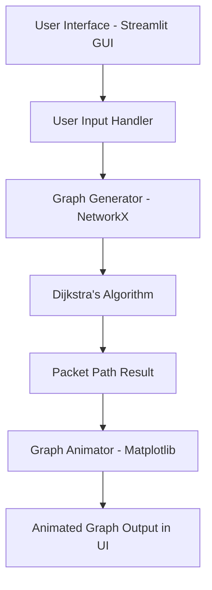
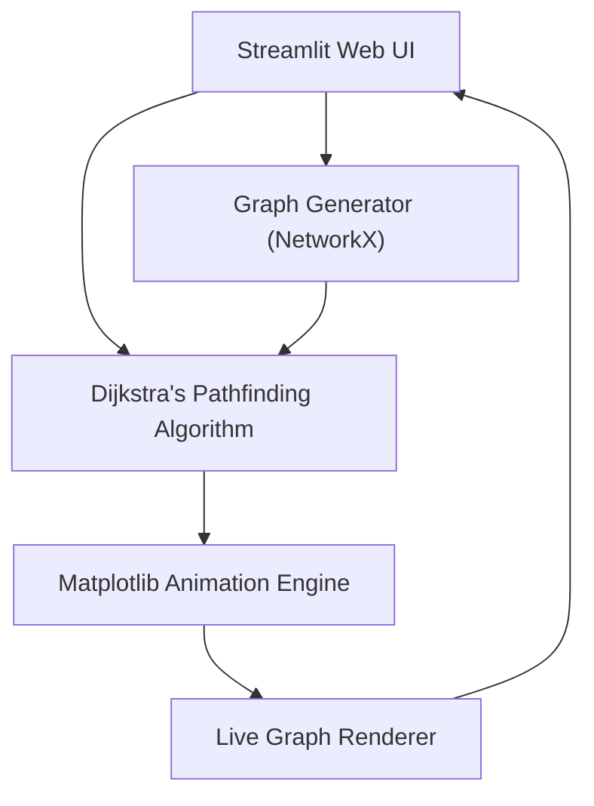

# 🌐 ConnectFlow: Animated Network Routing Simulator

ConnectFlow is a Python-powered, interactive network simulator that visualizes how data packets are routed across a network of routers using Dijkstra’s shortest path algorithm. Built using Streamlit, **NetworkX, and **Matplotlib, it offers an animated and intuitive understanding of how real-world routing works.

---

## 🎯 Features

| Feature                  | Description                                                                 |
|--------------------------|-----------------------------------------------------------------------------|
| 🔁 Random Topology       | Generates a new, fully connected network graph every time                   |
| 🧭 Shortest Path Routing | Uses Dijkstra’s algorithm to compute least-cost routes                      |
| 🔵 Animated Path         | Visualizes data packet movement hop-by-hop using blue edges                 |
| 👨‍💻 Interactive GUI      | Streamlit-powered interface for router selection and simulation             |
| 📊 Visual Feedback       | Graph with labeled nodes and edge weights for clarity                       |

---

## 📂 Project Structure
```
ConnectFlow/
├── network_routing_app.py      # 🔧 Main Streamlit application logic
├── requirements.txt            # 📦 Python dependencies
├── README.md                   # 📘 Project documentation
├── venv/                       # 🧪 Python virtual environment (should NOT be pushed to GitHub)
└── assets/                     # 🖼 Screenshots, diagrams, or other media files
```

  
---

## 🚀 How to Run

1. Install Python 3.11+
2. Install dependencies:

bash
pip install -r requirements.txt


3. Run the Streamlit app:
 bash  
streamlit run network_routing_app.py

4. Open your browser at:
bash
http://localhost:8501


## 🧠 Data Flow Diagram
---


## 📸screenshot


## 📚 Learning Outcomes
- ✅ Hands-on with graph theory and shortest-path algorithms

- ✅ Applied Dijkstra’s algorithm to realistic scenarios

- ✅ Built and deployed a responsive GUI with Streamlit

- ✅ Learned how to visualize and animate data routing

---
## 🏗 System Architecture



## 🧾 Dependencies
- streamlit
- networkx
- matplotlib

## 👨‍💻 Made By
- Sahil Pal
- Manan kathuria https://github.com/Manan-78581
